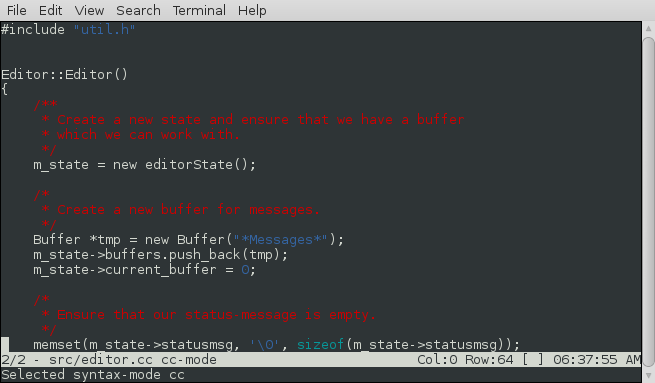

# Kilua

Kilua is an small, extensible, and Lua-powered text editor.

The project was orginally based upon the minimal [kilo editor](https://github.com/antirez/kilo) originally written by @antirez, and [introduced here on his blog](http://antirez.com/news/108), but now shares no code with that project, just ancestry.

kilua was written by [Steve Kemp](https://steve.kemp.fi/) and features many updates and additions compared to the original project:

* Complete handling for UTF-8 and multi-byte text.
* The ability to open/edit/view multiple files
   * This is done [via buffers](#buffers).
* The addition of an embedded Lua instance.
   * You can define functions in your [init-files](#lua-support), and invoke them via `M-x function()`.
* Regular expression support for searching.
* The adition of [syntax-highlighting](#syntax-highlighting) via the `lua-lpeg` library.
    * **NOTE**: You should see the [installation](#installation) section for caveats here.
    * Syntax-highlighting is updated in the background, when the editor is idle, to avoid stalls and redraw delays.
* The notion of [named marks](#bookmarks).
* The [status bar](#status-bar) is configured via Lua.
* Several bugfixes.

Launching `kilua` works as you would expect:

    $ kilua [options] [file1] [file2] ... [fileN]

Once launched the arrow keys will move you around, and the main keybindings
to learn are:

    Ctrl-x Ctrl-o Open a new file in the current buffer.
    Ctrl-x Ctrl-s Save the current file.
    Ctrl-x Ctrl-c Quit.

    Ctrl-x c      Create a new buffer
    Ctrl-x n      Move to the next buffer.
    Ctrl-x p      Move to the previous buffer.
    Ctrl-x b      Select buffer from a list

    M-x           Evaluate lua at the prompt.
    Ctrl-r:       Regular expression search.

## Command Line Options

The following command-line options are recognized and understood:

* `--config file`
    * Load the named (lua) configuration file, in addition to the defaults.
* `--dump-config`
    * Display the (embedded) default configuration file.
* `--eval`
    * Evaluate the given lua, post-load.
* `--syntax-path`
    * Specify the location of syntax-highlighting functions.
* `--version`
    * Report the version and exit.

## Installation

Installation should be straight-forward, to build the code run:

    make

Once built you can run this in a portable fashion, like so:

    ./kilua --syntax-path ./syntax [options] [file1] [file2] .. [fileN]

The usage of `--syntax-path` is required to load the syntax files, but
you can remove the option if you copy the contents of the `./syntax/`
directory to either:

* `/etc/kilua/syntax/`
* `~/.kilua/syntax/`

If you don't specify the location of the syntax-highlighting libraries,
and you don't install them then you'll have zero syntax-highlighting support.

This is a consequence of placing the syntax-highlighting code in external
libraries: If you can't load those libraries then the functionality will
not be available.

## Lua Support

We build with Lua 5.2 by default, but if you edit `src/Makefile` you
should also be able to build successfully with Lua 5.1.

On startup the following configuration-files are read if present:

* `~/.kilua/init.lua`.
* `./.kilua/$hostname.lua`.
   * This is useful for those who store their dotfiles under revision control and share them across hosts.
   * You can use the `*Messages*` buffer to see which was found, if any.

If neither file is read then the embedded copy of `kilua.lua`, which
was generated at build-time will be executed, which ensures that the
minimum functionality is present.  (i.e. If you load zero config
files then there won't be any keybindings setup so you can neither
navigate nor edit!)

It is assumed you'll edit the [supplied startup](kilua.lua) file, to
change the bindings to suit your needs, add functionality via
the [supplied lua primitives](PRIMITIVES.md), and then copy into
`~/.kilua/init.lua` (perhaps extending that with a per-host file too).

Without any changes you'll get a functional editor which follows my
particular preferences.

> **Pull-requests** implementing useful functionality will be recieved with thanks, even if just to add syntax-highlighting for additional languages.

## Callbacks

In the future more callbacks might be implemented, which are functions the
C-core calls at various points.

Right now the following callbacks exist and are invoked via the C-core:

* `get_status_bar()`
    * This function is called to populate the status-bar in the footer.
* `on_complete(str)`
    * This function is invoked to implement TAB-completion at the prompt.
* `on_idle()`
    * Called roughly once a second, can be used to run background things.
    * If this function isn't defined it will not be invoked.
    * This is used to update syntax in the background.
* `on_key(key)`
    * Called to process a single key input.
    * If this function isn't defined then input will not work, it is required.
* `on_loaded(filename)`
    * Called when a file is loaded.
    * This sets up syntax highlighting in our default implementation for C and Lua files.
    * If this function is not defined then it will not be invoked.
* `on_save(filename)`
    * Called __before__ a file is saved.
    * Can be used to strip trailing whitespace, etc.
    * If this function is not defined then it will not be invoked.
* `on_saved(filename)`
    * Called __after__ a file is saved.
    * Can be used to make files executable, etc.
    * If this function is not defined then it will not be invoked.

## Buffers

`kilua` allows multiple files to be opened, via the use of buffers.  If `kilua` is launched without any filename parameters there will be two buffers:

* `*Messages*`
    * This receives copies of the status-message.
* An unnamed buffer for working with.
    * Enter your text here, then use `Ctrl-x Ctrl-s`, or `M-x save("name")`, to save it.

Otherwise there will be one buffer for each file named upon the command-line,
as well as the `*Messages*` buffer.  (You can kill the `*Messages*` buffer
if you wish, but it's a handy thing to have around.)

The default key-bindings for working with buffers are:

Action                             | Binding
---------------------------------- | --------------
Create a new buffer.               | `Ctrl-x c`
Kill the current buffer.           | `Ctrl-x k`
Kill the current buffer, forcibly. | `Ctrl-x K`
Select the next buffer.            | `Ctrl-x n` or `M-right`
Select the previous buffer.        | `Ctrl-x p` or `M-left`
Choose a buffer, via menu.         | `Ctrl-x b` or `Ctrl-x B`

It's worth noting that you can easily create buffers dynamically, via lua, for
example the following function can be called by `M-x uptime()`, and does
what you expect:

* Select the buffer with the name `*uptime*`.
     * If that buffer doesn't exist then create it.
* Move to the end of the buffer.
     * Insert the output of runing `/usr/bin/uptime` into the buffer.

Uptime sample:

      -- Run `uptime`, and show the result in a dedicated buffer.
      function uptime()
          local result = buffer( "*uptime*" )
          if ( result == -1 ) then create_buffer("*uptime*") end
          -- move to end of file.
          eof()
          insert(cmd_output("uptime"))
      end

## Bookmarks

You can record your position (i.e. "mark") in a named key, and
later jump to it, just like in `vi`.

To record the current position use `M-m`, and press the key
you wish to use.  To return to it use `M-b XX` where XX was the
key you chose.

## Status Bar

The status-bar, shown as the penultimate line in the display, contains
the name of the current file/buffer, as well as the cursor position, etc.

The contents of the status-bar are generated via Lua, so it is simple
to modify.  The default display shows:

     "${buffer}/${buffers} - ${file} ${mode} ${modified} #BLANK# Col:${x} Row:${y} [${point}] ${time}"

Values inside "`${...}`" are expanded via substitutions and the following
are provided by default:

Name             | Meaning
---------------- | --------------
`${buffers}`     | The count of open buffers.
`${buffer}`      | The number of the current buffer.
`${date}`        | The current date.
`${file}`        | The name of the file/buffer.
`${mode}`        | The syntax-highlighting mode in use, if any.
`${modified}`    | A string that reports whether the buffer is modified.
`${point}`       | The character under the point.
`${time}`        | The current time.
`${words}`       | The count of words in the buffer.
`${x}`           | The X-coordinate of the cursor.
`${y}`           | The Y-coordinate of the cursor.

> **Pull-requests** adding more options here would be most welcome.

## Syntax Highlighting

Syntax highlighting is handled via the `lua-lpeg` library, and so if
that is not installed it will not be available.

Each buffer has an associated syntax-highlighting mode, which is a string
such as "c", "markdown", or "lua".  The default configuration file sets
the mode based upon the suffix of the file you're editing.

If you wish to change the mode interactivally to Lua, for example, then run:

    M-x syntax("lua")

The implementation of syntax highlighting requires the loading of
a library.  For example the syntax highlighting of lua requires
that the library `lua.lua` is loaded - The syntax modes are looked
for in these locations:

* `/etc/kilua/syntax`
    * Global syntax-modes.
* `~/.kilua/syntax`
    * Per-user syntax-modes.
* The path specified via the `--syntax-path` command-line option.

The implementation is pretty simple:

* A buffer consists of rows of text.
     * Each row contains both the character(s) in the row and the colour of each character.
     * The Lua function `update_colours` will allow the colour of each single character in the buffer to be set.

To avoid delays when inserting text the rendering is updated in the background,
via the `on_idle()` callback.  This function does the obvious thing:

* Retrieves the current contents of the buffer, via `text()`.
* Invokes the LPEG parser on it.
    * This will generate a long string containing the colour of each byte of the text.
* Set those colours, via `update_colours()`.

As a concrete example, if the buffer contains the string "Steve Kemp" then
the call to `update_colours` should contain:

     `RED RED RED RED RED WHITE GREEN GREEN GREEN GREEN`

That would result in "Steve" being displayed in red, and "Kemp" in green.

Currently we include syntax-highlighting for:

* C
* C++
* Lua
* Lisp
* HTML
* `Makefile`s.
* Plain-text/markdown
    * This is a simple implementation which only highlights URLs and trailing whitespace.

> **Pull-requests** adding more syntax modes would be most welcome.

## Discussion on Hacker News

https://news.ycombinator.com/item?id=12137698

## The Future

There are no obvious future plans, but [bug reports](https://github.com/skx/kilua/issues) may be made if you have a feature to suggest (or bug to report)!

One thing that might be useful is a split-display, to view two files
side by side, or one above the other.  This is not yet planned, but
I think it could be done reasonably cleanly.

Steve
\--
https://steve.kemp.fi/
